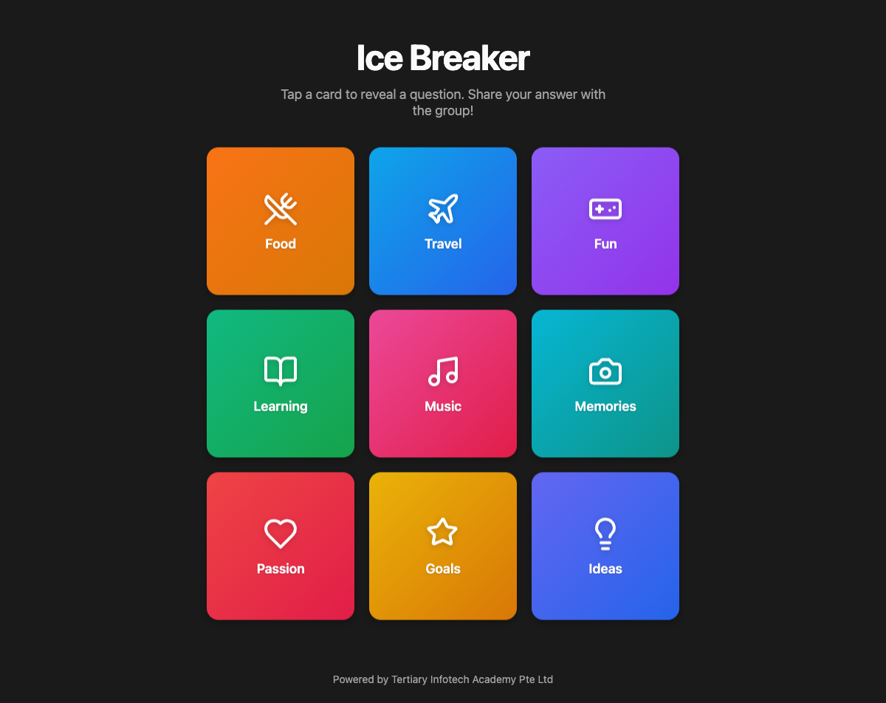

<div align="center">

# Ice Breaker

[](https://developer.mozilla.org/en-US/docs/Web/HTML)
[](https://developer.mozilla.org/en-US/docs/Web/CSS)
[](https://developer.mozilla.org/en-US/docs/Web/JavaScript)
[](LICENSE)
[](https://alfredang.github.io/ice-breaker)

**An interactive flip card web app for ice breaker activities in training and classroom sessions.**

[Live Demo](https://alfredang.github.io/ice-breaker) · [Report Bug](https://github.com/alfredang/ice-breaker/issues) · [Request Feature](https://github.com/alfredang/ice-breaker/issues)

</div>

## Screenshot



## About

Ice Breaker is a simple, engaging web app designed for trainers and educators. Learners tap colorful cards to reveal random questions that spark conversation and build rapport in group settings. No accounts, no setup — just open and go.

### Key Features

- **9 flip cards** in a 3x3 grid with colorful gradient fronts, icons, and labels
- **Smooth 3D flip animation** using CSS transforms
- **20 random ice breaker questions** with no-repeat logic until the pool is exhausted
- **Reset button** to flip all cards back and start a new round
- **Responsive design** — works on desktop, tablet, and mobile
- **Accessible** — keyboard navigable (Enter/Space), ARIA labels, focus indicators
- **Dark mode** UI with modern styling
- **Zero dependencies** — pure HTML, CSS, and JavaScript

## Tech Stack

| Category | Technology |
|----------|------------|
| **Markup** | HTML5 (semantic elements, ARIA attributes) |
| **Styling** | CSS3 (3D transforms, CSS Grid, custom properties, `clamp()`) |
| **Logic** | Vanilla JavaScript (ES6+, no frameworks or libraries) |
| **Deployment** | GitHub Pages |

## Architecture

```
┌─────────────────────────────────────┐
│            index.html               │
│  ┌───────────┐   ┌───────────────┐  │
│  │ style.css │   │    app.js     │  │
│  │           │   │               │  │
│  │ • Grid    │   │ • Card init   │  │
│  │ • 3D flip │   │ • Flip logic  │  │
│  │ • Themes  │   │ • Question    │  │
│  │ • Responsive  │   pool mgmt  │  │
│  └───────────┘   │ • Reset       │  │
│                  └───────────────┘  │
└─────────────────────────────────────┘
```

## Project Structure

```
ice-breaker/
├── index.html       # Main HTML page
├── style.css        # All styles (grid, cards, animations, responsive)
├── app.js           # Card logic, question pool, flip/reset handlers
├── screenshot.png   # App screenshot for README
└── README.md        # Project documentation
```

## Getting Started

### Prerequisites

- A modern web browser (Chrome, Firefox, Safari, Edge)

### Installation

```bash
# Clone the repo
git clone https://github.com/alfredang/ice-breaker.git
cd ice-breaker

# Open in browser
open index.html
```

Or visit the live site: **[https://alfredang.github.io/ice-breaker](https://alfredang.github.io/ice-breaker)**

## How It Works

1. Click or tap any card to flip it and reveal a random ice breaker question
2. Share your answer with the group
3. Keep flipping cards to discover more questions
4. Hit **Reset Cards** to start a new round

Questions are drawn without repeats until all 20 have been used, then the pool resets automatically.

## Deployment

This project is deployed on **GitHub Pages** directly from the `main` branch. No build step required.

To deploy your own fork:

1. Fork this repository
2. Go to **Settings → Pages**
3. Set source to **Deploy from a branch** → `main` → `/ (root)`
4. Your site will be live at `https://<your-username>.github.io/ice-breaker`

## Contributing

Contributions are welcome!

1. Fork the repository
2. Create your feature branch (`git checkout -b feature/amazing-feature`)
3. Commit your changes (`git commit -m 'Add amazing feature'`)
4. Push to the branch (`git push origin feature/amazing-feature`)
5. Open a Pull Request

## License

Distributed under the MIT License. See `LICENSE` for more information.

---

<div align="center">

**Developed by [Tertiary Infotech Academy Pte Ltd](https://www.tertiary-infotech.com)**

If you found this useful, give it a ⭐ on [GitHub](https://github.com/alfredang/ice-breaker)!

</div>
